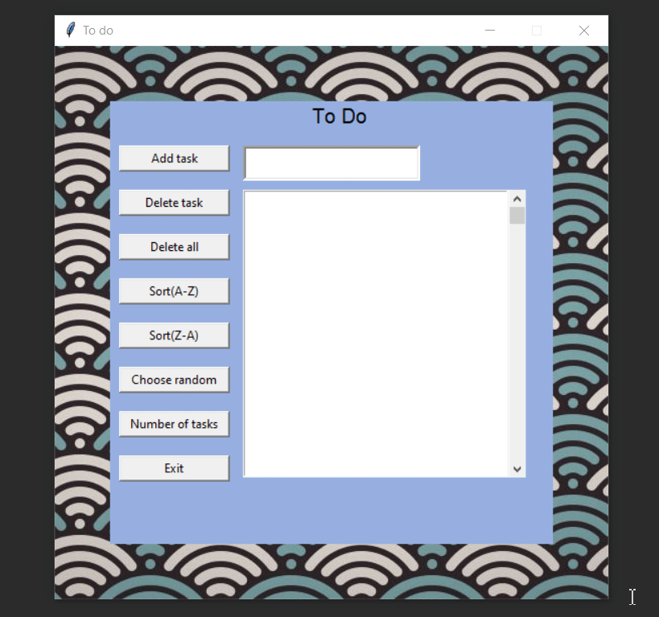

# ✅ To Do List App (Tkinter)


A simple but feature-rich desktop **To Do list app** built using **Python 3.6** and **Tkinter** GUI toolkit.  
You can add tasks, sort them, delete them, save them — all within a minimal and colorful UI 🌈

> ⚠️ This project was built during the early stages of my coding journey (~2019).  
> It’s no longer maintained but reflects some of my first hands-on Python GUI development.

---

## 📸 Live Demo

  

---

## 🧠 Features

- ✅ Add, delete, and view tasks
- 🔄 Sort tasks A–Z / Z–A
- 🎲 Pick a random task
- 🧮 Count total tasks
- 💾 Save task list using Python `pickle` (file-based persistence)
- 🖼️ Custom background image
- 🖱️ Scrollable list UI

---

## 🚀 How to Run

### Requirements

- Python 3.6+
- [Pillow](https://pypi.org/project/Pillow/) for image support

### Install dependencies

```bash
pip install Pillow
```

### Run the App
```bash
python todolistapp.py
```
